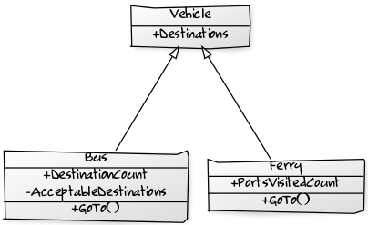
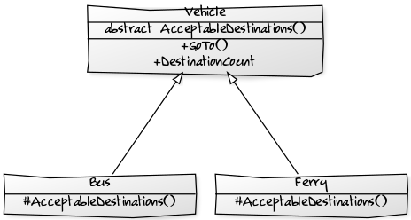

An exercise in refactoring without changing behaviour

Get the code: 

    git clone https://github.com/pete-the-programmer/tdd-ex-refactor1

## Starting point

## Finish point

<!--
https://yuml.me/diagram/scruffy/class/draw

[Vehicle|+Destinations]
[Bus|+DestinationCount;-AcceptableDestinations|+GoTo()]
[Ferry|+PortsVisitedCount|+GoTo()]
[Vehicle]^-[Ferry], [Vehicle]^-[Bus]

[Vehicle|abstract AcceptableDestinations()|+GoTo();+DestinationCount]
[Bus|%23AcceptableDestinations()]
[Ferry|%23AcceptableDestinations()]
[Vehicle]^-[Ferry], [Vehicle]^-[Bus]
-->
